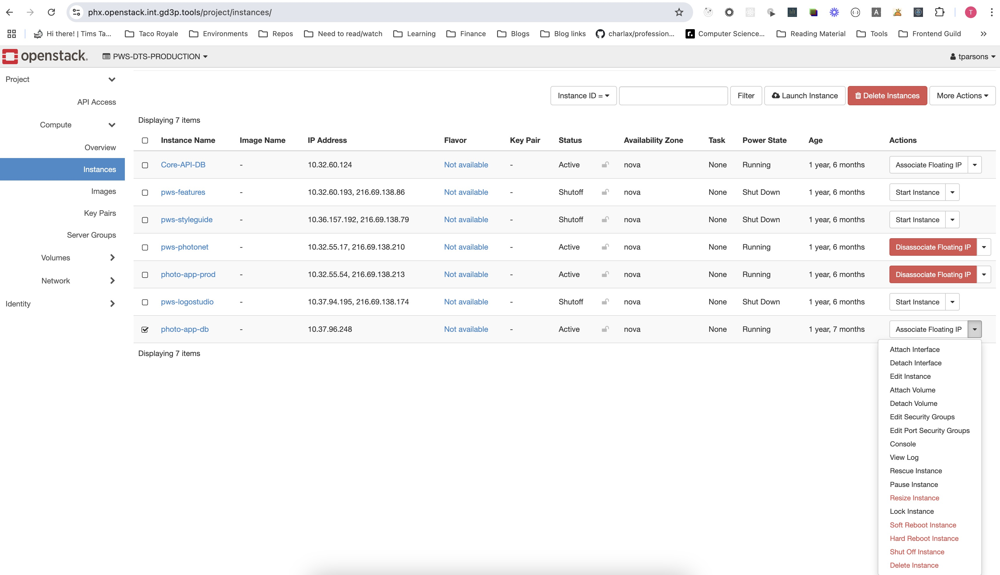
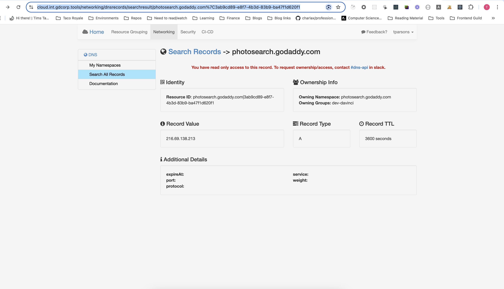

### End of Life an App

In this case we are EOL'ing Photo Search

#### Openstack VM
- Choose delete instance from [Cloud UI](https://phx.openstack.int.gd3p.tools/project/instances/)

#### Decommission URL
- Go to [Cloud DNS UI](https://cloud.int.gdcorp.tools/networking/dnsrecords/search) and search for photosearch.godaddy.com
- 
- In this case I needed to go to [#dns-api](https://godaddy.enterprise.slack.com/archives/C1J26Q8F8) slack channel to ask for change of [ownership](https://godaddy.slack.com/archives/C1J26Q8F8/p1737493214446389)
