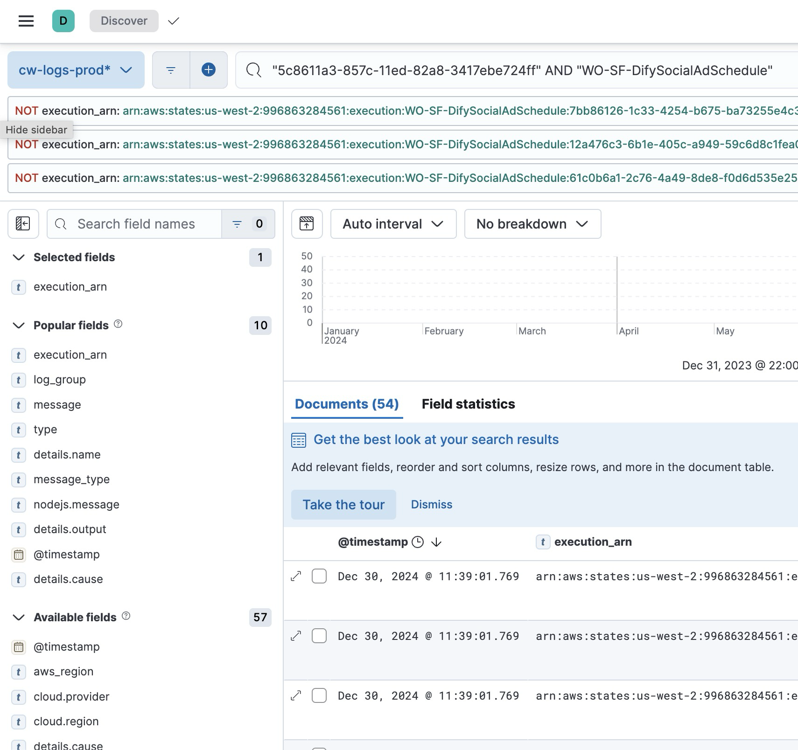
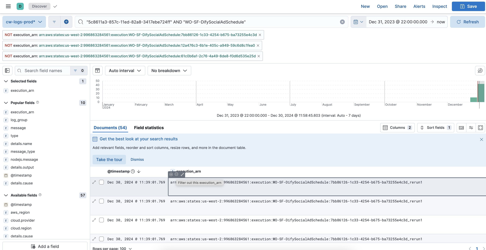

- Find [duplicates](https://difywos-prod-usw2.kb.us-west-2.aws.found.io:9243/app/discover#/?_g=(filters:!(),refreshInterval:(pause:!t,value:0),time:(from:%272024-01-01T05:00:00.000Z%27,to:%272024-02-28T14:21:33.063Z%27))&_a=(columns:!(),filters:!(),index:ed9c6ec0-6901-11ee-ae92-779ec57695c4,interval:auto,query:(language:kuery,query:%27%22823966b3-69d8-11ee-830a-3417ebe724ff%22%20AND%20%22WO-SF-DifySocialAdSchedule%22%27),sort:!(!(%27@timestamp%27,desc))))
- Alter current date to today’s date
- Search for accountId (from execution input)
- Select `execution_arn` from Popular Fields on left

- Filter out execution by hovering an pressing `-` button

- Check arns against the list of arns in AWS. If present in AWS check if Failed or Succeeded. Press `-` in kibana logs to remove from list. Make sure there are no running ads.
- Pause ad and then rerun execution.
